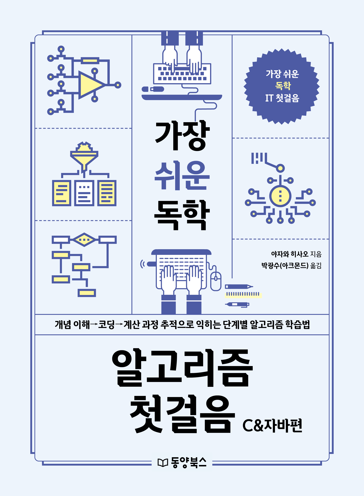

# 『가장 쉬운 독학 알고리즘 첫걸음 - C&자바편』

동양북스 『가장 쉬운 독학 알고리즘 첫걸음 - C&자바편』의 깃허브 저장소입니다.

## 예제 파일 다운로드
저장소를 클론하지 않을 분은 [이곳](https://bit.ly/30uEf4x)을 눌러서 예제 파일을 다운로드하세요.

## 구매하기
[교보문고](https://bit.ly/3BI4S3p) | [YES24](https://bit.ly/3lDeMOc) | [알라딘](https://bit.ly/2YRaElb) | [인터파크](https://bit.ly/3v8CJA6)

## 책 소개
**프로그래밍 사고력을 키우는 알고리즘 기초 학습을 만난다!**

처음 알고리즘을 배울 때는 보통 주제별 개념을 이해하고, 예제 프로그램 코드를 작성해본 후, 응용문제를 풀면서 실력을 다집니다. 그런데 예제 프로그램 코드를 작성할 때까지는 쉽게 느껴졌던 알고리즘이 응용문제를 풀 때는 어려움으로 다가옵니다. 어떤 변수를 추가하거나 변경해야 할지, 제어문의 조건은 어떻게 바꾸거나 설정해야 할지 등이 익숙하지 않은 것입니다. 또한 어디까지는 코드를 맞게 작성했고 어디서부터 코드를 잘못 작성했는지를 알아야 적절하게 코드를 수정하는데 이를 처음부터 잘하기란 어렵습니다. 이는 알고리즘을 처음 공부하는 사람이라면 누구나 한번은 겪는 일입니다.

이 책은 방금 설명한 입문자의 어려움을 해결하도록 고안한 알고리즘 입문서입니다. 그림과 의사코드 등을 사용하는 기존 알고리즘 학습 방법에 알고리즘의 중간 실행 결과를 살펴볼 수 있는 추적 코드 작성법을 함께 살펴봅니다. 이 추적 코드는 실제 알고리즘이 동작하는 과정을 이해할 수 있게 하고, 원하는 결과가 나오지 않을 때 어느 부분에 문제가 생겼는지는 파악하는 힘을 길러줍니다. 기존의 알고리즘 학습법이 답답했다면 이 책과 함께 추적 코드를 활용하는 새로운 알고리즘 학습법을 만나보기 바랍니다.

## 예제 파일 실행 방법
윈도우에서 마이크로소프트의 Visual Studio Code로 예제 파일을 실행하려는 분은 [예제 코드 실행하기(Windows 버전)](https://bit.ly/3FVxby2)을 참고하세요.